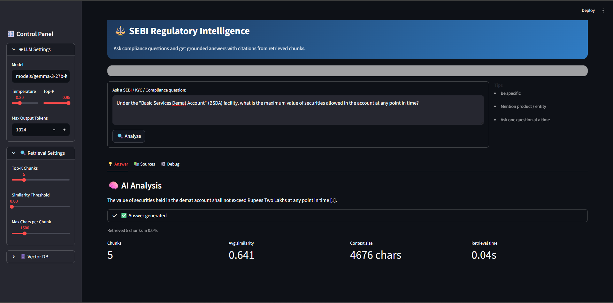

# SEBI Regulatory RAG Intelligence (with Endee)

A Retrieval-Augmented Generation (RAG) system built to provide precise, grounded answers to regulatory queries using the **SEBI Master Circular for Depositories** and **Endee** (Vector Database).

## Screenshot


---

## Dataset Justification

This project utilizes the **SEBI Master Circular for Depositories (October 06, 2023)** as its primary knowledge base.

### Why this file?
1.  **Comprehensive Coverage**: A "Master Circular" consolidates all critical instructions issued by SEBI over a period, serving as a single source of truth for compliance officers.
2.  **High Relevance**: It covers essential topics like **KYC (Know Your Client)**, **Beneficial Ownership (BO)**, **Account Closure**, and **BSDA (Basic Services Demat Account)** limits.
3.  **Structured Format**: The document is structured with clear clauses (e.g., `1.1.1`), making it ideal for semantic chunking and precise retrieval.
4.  **Regulatory Authority**: As a SEBI-issued document, it carries the highest level of authority for market participants, ensuring the AI's answers are legally grounded.

**File Location**: `dataset\Master_Circular_For_Depositories.pdf`

---

## Architecture

The application follows a standard RAG pipeline, enhanced with custom chunking and the **Endee** vector database.

### Core Components
Based on the `RAG_APPLICATION` implementation:

1.  **Ingestion Pipeline**:
    *   **PDF Parsing**: Extracts raw text from the PDF using `pymupdf` (fitz).
    *   **Semantic Chunking** (`chunking.py`): Splits text intelligently based on clause numbers (e.g., `1.1`, `1.2`) rather than arbitrary character counts. This preserves the context of each regulation.
        *   **Strategy**:
            *   `MAX_CHUNK_SIZE` (2500 chars): Selected to capture full complex clauses (approx. 500-800 tokens) in a single block without exceeding the embedding model's effective context window.
            *   `MIN_CHUNK_SIZE` (200 chars): Defines a noise floor to filter out headers, footers, and page numbers.
            *   `CHUNK_OVERLAP` (150 chars): Provides a safety margin to preserve context if a hard split is forced within a long clause.

2.  **Vector Store (Endee)**:
    *   Stores embeddings and metadata (Clause ID, Section Title, Page Number).
    *   Performs fast similarity searches to retrieve relevant regulatory clauses.

3.  **RAG Application (`app.py`)**:
    *   **UI**: Built with **Streamlit** for an interactive chat interface.
    *   **Retrieval**: Queries Endee for the top-k most similar chunks to the user's question.
    *   **Generation**: Uses **Google's Gemma 2-27b-it** (via Gemini API) to synthesize an answer based *only* on the retrieved context.

### Data Flow
`PDF` → `Chunks (JSON)` → `Embeddings (JSON)` → `Endee (Vector DB)` → `Streamlit App`

---

## Setup & Installation

### Prerequisites
*   **Docker Desktop** (For running Endee)
*   **Python 3.10+** (Tested on Python 3.10)
*   **Google AI Studio API Key** (for Gemini/Gemma models)

### 1. Clone the Repository
```bash
git clone https://github.com/Madhesh4124/sebi_regulatory_rag_with_endee.git
cd sebi_regulatory_rag_with_endee
```

### 2. Set Up Endee (Vector DB)

**Prerequisite**: Ensure **[Docker](https://docs.docker.com/get-docker/)** is installed and running on your machine.

1.  **Clone the Endee Repository**:
    ```bash
    git clone https://github.com/endee-io/endee
    cd endee
    ```

2.  **Configure Docker Compose**:
    Update the `docker-compose.yml` file.
    *Why?* We need to modify the default configuration to enable authentication by setting the `NDD_AUTH_TOKEN`.
    
    > **Important**: This `NDD_AUTH_TOKEN` must match the `ENDEE_API_KEY` you will set in the application's `.env` file later.

    ```yaml
    services:
      endee:
        image: endeeio/endee-server:latest
        container_name: endee-server
        ports:
          - "8080:8080"
        environment:
          NDD_NUM_THREADS: 0
          NDD_AUTH_TOKEN: "YOUR_API_KEY" # Set your own secure API key
        volumes:
          - endee-data:/data
        restart: unless-stopped

    volumes:
      endee-data:
    ```
    > **Security Note**: The key shown above is an example; verify you use a secure key and do not commit this file to version control.

3.  **Start the Server**:
    ```bash
    docker compose up -d
    ```
    This will download the image and start the Endee container in the background.

4.  **Verify Service**:
    Check if the container is running:
    ```bash
    docker compose ps
    ```
    You should see `endee-server` with status `Up`. The service will be available at `http://localhost:8080`.

### 3. Application Setup
Navigate back to the project root and then to the application directory:
```bash
cd ../RAG_APPLICATION
```

Create a virtual environment (recommended):
```bash
python -m venv venv
# Windows
venv\Scripts\activate
# Linux/Mac
source venv/bin/activate
```

Install dependencies:
```bash
pip install -r requirements.txt
```

### 4. Configure Environment Variables
Create a `.env` file in the `RAG_APPLICATION` directory (see `.env.example`):
```ini
GOOGLE_API_KEY=your_google_api_key_here
ENDEE_API_KEY=your_endee_api_key_here  # If applicable based on your Endee setup
```

---

## Grounding & Anti-Hallucination

In regulatory contexts, accuracy is non-negotiable. This system employs strict measures to prevent hallucinations:

1.  **Retrieval-Only Constraint**: The LLM prompt explicitly instructs the model to use **ONLY** the provided context.
    > *"STRICT RULES: Use ONLY the provided context. Do NOT use outside knowledge."*
2.  **Conservative Refusals**: If the retrieved chunks do not contain the answer, the model is instructed to state: *"The provided documents do not specify this."* It does not attempt to fabricate an answer.
3.  **Mandatory Citations**: Every factual claim must be backed by a clause citation (e.g., `[1.2.1]`), allowing users to verify the source immediately.

> **Note**: These constraints are enforced via prompt engineering and application logic. While effective, they do not provide a theoretical guarantee against all model hallucinations.

---

## Evaluation & Validation

The system's accuracy was qualitatively evaluated against specific regulatory queries.

### Test Cases
| Query Category | Example Question | Expected Behavior | Verification |
| :--- | :--- | :--- | :--- |
| **Fact Retrieval** | "What is the BSDA holding limit?" | Returns `₹2 Lakhs` / `₹10 Lakhs` thresholds with clause citation. | Verified against Section 5.1 of Master Circular. |
| **Process** | "What is the procedure for account closure?" | Summarizes steps from **Section 10** (Closure of Accounts). | Validated that all steps are present and in correct order. |
| **Out of Scope** | "What are the rules for Mutual Fund schemas?" | Returns *"The provided documents do not specify this."* (Correct Rejection). | Confirmed that model did not hallucinate MF rules not in the PDF. |

### Methodology
*   **Manual Verification**: 20+ test queries were run, and the generated citations were cross-checked against the original PDF to ensure the clause numbers matched the content.
*   **Citation Accuracy**: In our qualitative test set, the system linked answers to their specific sub-clauses (e.g., `1.1.2` vs just `1`).

---

## Model Justification

### Embedding Model: `sentence-transformers/all-MiniLM-L6-v2`
*   **Why**: We chose `all-MiniLM-L6-v2` for its optimized balance of speed and performance. It maps sentences to a 384-dimensional dense vector space.
*   **Trade-off**: While larger models (like `all-mpnet-base-v2`) offer slightly better semantic capture, `MiniLM` is significantly faster for real-time CPU-based inference.
*   **Clause-Level Retrieval**: The semantic chunking strategy reduces the burden on the embedding model, allowing this general-purpose model to effectively retrieve relevant regulatory blocks without domain-specific pre-training.

### Generation Model: `Gemma 2-27b-it`
*   **Why**: A high-parameter open model fine-tuned for instruction following. It demonstrates strong reasoning capabilities necessary for synthesizing answers from complex legal text.

---

## Known Limitations

1.  **Single-Document Scope**: The knowledge base is currently limited to the *Master Circular for Depositories*. It does not know about other SEBI circulars (e.g., for Mutual Funds or AIFs) unless they are added.
2.  **Static Knowledge**: The system does not automatically update. If SEBI issues a new circular tomorrow, the system will not know it until the PDF is replaced and the pipeline (chunking -> embedding) is re-run.
3.  **No Cross-Document Reasoning**: The system retrieves text chunks based on semantic similarity. If an answer requires synthesizing information from two completely different unrelated circulars (not present here), it may struggle.
4.  **Retrieval Dependence**: If the relevant clause is not in the `top-k` retrieved chunks (due to poor semantic match), the LLM cannot answer, even if the document contains the answer elsewhere.

---

## Intended Users

*   **Compliance Officers**: For quick lookup of specific clauses and procedural requirements.
*   **Legal/Regulatory Analysts**: To verify specific rule limits (e.g., timelines, thresholds).
*   **Students/Researchers**: To understand the structure of SEBI regulations.

> **DISCLAIMER**: This tool is an **assistive AI system**. It is NOT a substitute for professional legal advice. Always verify important compliance decisions against the official SEBI documents linked in the citations.

---

## Running the Pipeline

Before running the app, you must process the data and load it into Endee.

### Step 1: Chunk the PDF
Process the raw PDF into semantic chunks.
```bash
python chunking.py
```
*Output: `chunks.json`*

### Step 2: Generate Embeddings
Convert chunks into vector embeddings.
```bash
python embedding.py
```
*Output: `chunks_with_embeddings.json`*

> **Tip**: If you don't see the generated JSON files in your file explorer immediately, click the **Refresh** icon in your IDE or collapse/expand the folder.

### Step 3: Insert into Endee
Run the Jupyter notebook to upsert vectors into the database.
```bash
jupyter notebook insert_embeddings.ipynb
```
*Run all cells in the notebook to create the index and upload data.*

---

## Running the Application

Once the database is populated, launch the Streamlit app:

```bash
streamlit run app.py
```

Open your browser to the URL shown (usually `http://localhost:8501`). You can now ask questions effectively grounded in SEBI regulations.

---

## Conclusion

This project demonstrates a practical, regulation-aware Retrieval-Augmented Generation (RAG) system designed for querying SEBI depository regulations in a grounded and verifiable manner. By combining clause-level semantic chunking, vector-based retrieval using Endee, and constrained generation with mandatory citations, the system prioritizes correctness and traceability over open-ended text generation.

Rather than treating the language model as a source of regulatory knowledge, the design deliberately positions it as a synthesis layer operating strictly on retrieved SEBI clauses. This makes the system suitable for assistive use in compliance analysis, regulatory interpretation, and academic exploration—while explicitly avoiding unsupported inference or legal advice.

While the current implementation is limited to a single SEBI Master Circular and requires manual re-ingestion for updates, the architecture is extensible. Additional circulars, cross-document retrieval, and automated update pipelines can be incorporated without changing the core design principles.

Overall, this project serves as a reference implementation of how RAG systems can be responsibly applied in regulated domains, where transparency, source attribution, and controlled behavior are more important than generative breadth.
